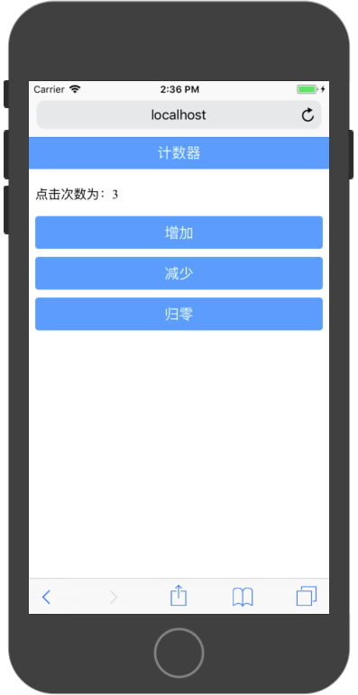
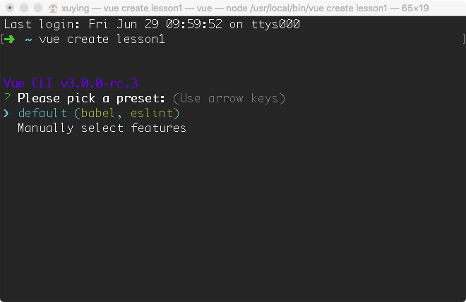

# 项目1：计数器



本节课程，我们使用一个简单的计数器App作为Vue开发的入门案例。

### 开发环境

Vue开发环境需要Nodejs支持，首先需要安装Nodejs运行环境。

Node安装成功之后，通过npm全局安装`vue-cli`工具。`npm i -g vue-cli`

本书中所有代码编辑器为VSCode

调试工具为谷歌浏览器

### 创建工程

通过`vue-cli`创建工程，在命令行运行：

```
vue create project1
```



选择`default`模式，点击回车按钮，之后便自动构建一个名为`lesson1`的vue工程。

工程创建完毕之后，使用VSCode打开，在VSCode的终端中输入:

```
npm i -S mint-ui
```

该命令为安装MintUI组件库，MintUI库有饿了么前端开发维护，是目前Vue非常流行的一套移动端组件库。我们的WebApp即基于此组件库进行开发。

MintUI的开发文档地址为：[http://mint-ui.github.io/#!/zh-cn](http://mint-ui.github.io/#!/zh-cn)

安装完成之后，在`main.js`文件中引入组件库和样式文件：

```
import MintUI from 'mint-ui'
import 'mint-ui/lib/style.css'
```

使用Vue提供的全局注册方法`use`对MintUI进行全局注册
```
Vue.use(MintUI);
```

最后通过`npm run serve`启动工程。

### main.js

main.js为代码运行入口，工程JavaScript代码从main.js开始运行，在该文件中，主要进行全局组件的注册和加载`App`根组件。


```
//引入Vue框架组件
import Vue from 'vue'

//引入App根组件
import App from './App.vue'

//引入MintUI框架组件和样式
import MintUI from 'mint-ui'
import 'mint-ui/lib/style.css'


//全局注册MintUI组件
Vue.use(MintUI);

//设置为 false 以阻止 vue 在启动时生成生产提示。
Vue.config.productionTip = false

//构建Vue根实例
new Vue({
  render: h => h(App)
}).$mount('#app')
```

### App.vue

计数器具体的实现在`App.vue`文件中，该文件即为一个Vue组件，Vue组件在文件中由三部分组成：

* `template`视图模板，在该标签下使用HTML元素或Vue组件构建视图页面。
* `script`Vue脚本，在该标签下处理该组件的事件
* `style`视图样式，在该标签下通过CSS为视图添加样式

### 构建计数器视图模板

计数器视图由以下元素组成：

* `mt-header`，应用标题
* `p`，点击次数显示
* `mt-button`，增加按钮
* `mt-button`，减少按钮
* `mt-button`，归零按钮

`mt-header`和`mt-buttom`是MintUI提供的组件，其具体使用方法可以通过MintUI开发文档获取。

```
<template>
  <div id="app">
        <mt-header
          id="header"
          fixed
          title="计数器"
        />
        <p id="content">
          123
        </p>
        <mt-button 
          class="btn"
          size="large"
          type="primary"
        >增加</mt-button>
        <mt-button 
          class="btn"
          size="large"
          type="primary"
        >减少</mt-button>
        <mt-button 
          class="btn"
          size="large"
          type="primary"
        >归零</mt-button>
      </div>
</template>
```

通过上述代码实现了计数器页面的构建工作，但该页面为静态页面，无法进行事件响应和更新点击数量显示。


### 添加页面动态数据

页面中p标签显示的数据应为动态变化。在Vue组件中，动态变化的数据存放在该组件下的Vue实例的`data`属性中。Vue实例的data属性为一个函数，该函数返回一个JavaScript数据对象，该返回对象中的键值可以直接被`template`中元素所使用。

```
export default {
  name: 'app',
  data:function(){
    return(
      {
        count:0,
      }
    )
  }
}
```

在`template`中可以直接通过返回对象的键获取其对应的值，但该键需要使用双大括号包裹。

```
<p id="content">
  {{count}}
</p>
```

通过这样的操作，便将模板中的数据与`data`进行绑定，当data中数据发生变化时，模板中的数据会自动进行更新。在后续的操作中，只需要根据事件对`data`中的值进行修改即可，无需对模板进行操作。

### 响应页面事件

该页面中用三个按钮需要分别响应其点击事件以完成计数功能。其事件响应函数定义在该组件的Vue实例中的`methods`属性中。在事件响应函数中，可以通过`this`对`data`中的数据进行操作。


```
<script>

export default {
  name: 'app',
  data:function(){
    return(
      {
        count:0,
      }
    )
  },
  methods:{
    add:function(){
      this.count++;
    },
    dec:function(){
      this.count--;
    },
    zero:function(){
      this.count = 0;
    }
  }
}
</script>
```

在模板中，通过组件的`@click`属性对事件进行绑定：

```
<mt-button 
  class="btn"
  size="large"
  type="primary"
  @click="add"
>增加</mt-button>
```

以上代码中，通过`@click="add"`对该按钮的点击事件处理函数绑定为在`methods`中定义的`add`处理函数。

`template`完整实现代码：

```
<template>
  <div id="app">
        <mt-header
          id="header"
          fixed
          title="计数器"
        />
        <p id="content">
          {{count}}
        </p>
        <mt-button 
          class="btn"
          size="large"
          type="primary"
          @click="add"
        >增加</mt-button>
        <mt-button 
          class="btn"
          size="large"
          type="primary"
          @click="dec"
        >减少</mt-button>
        <mt-button 
          class="btn"
          size="large"
          type="primary"
          @click="zero"
        >归零</mt-button>
      </div>
</template>
```

### 添加样式

根据设计要求，在`style`标签中添加响应的样式：

```
<style>

#content{
  margin-top: 60px;
}

.btn{
  margin-top: 10px;
}

#header{
  font-size: 18px;
}
</style>
```

### 总结

1. 安装`vue-cli`脚手架工具，通过该工具构建项目
2. 安装MintUI组件库，移动WebApp主要基于该组件库中的组件进行开发
3. 在`main.js`文件中引入MintUI组件库和样式，并全局该组件库中的组件
4. 在`App.vue`文件中`<template>`标签内，使用HTML元素或MintUI元素构建静态页面
5. 在`App.vue`文件中`<script>`标签内，创建一个Vue对象，并在该对象内实现`data`和`methods`。
6. 在`<template>`标签内使用`data`属性并为组件绑定`methods`中的事件处理函数
7. 在`style`标签内使用CSS语法为组件添加样式
