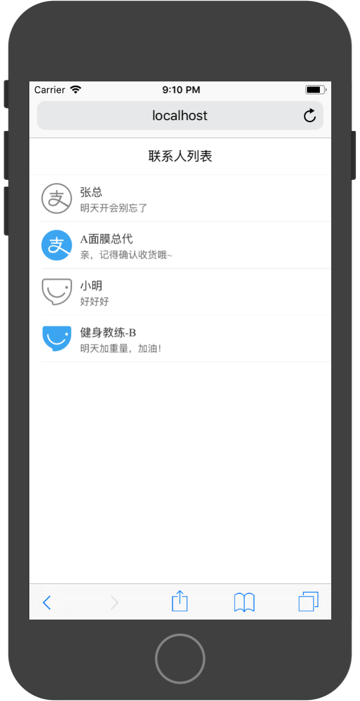
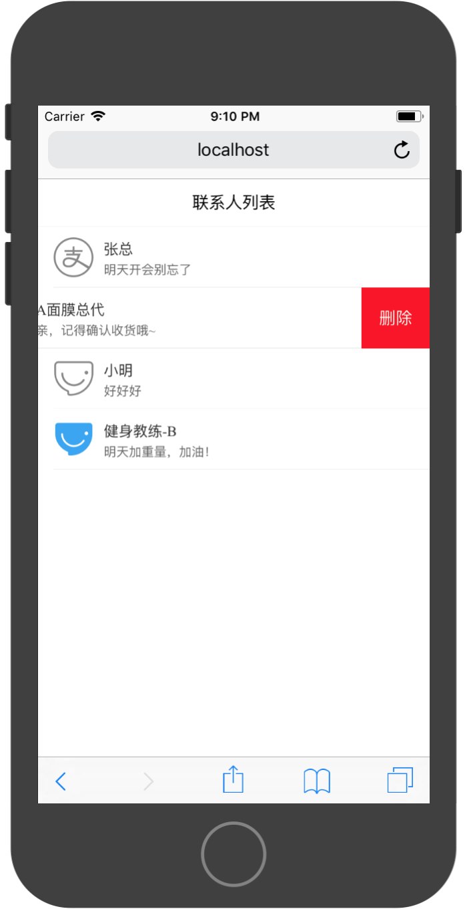

# 项目2：联系人列表




本节课程，我们使用一个联系人列表讲解Vue中组件化开发内容。

本节案例使用VantUI框架进行开发，Vant框架是有赞前端团队开源的Vue移动端组件库，提供标准的移动端组件体验。开发文档地址为：[https://youzan.github.io/vant/#/zh-CN/intro](https://youzan.github.io/vant/#/zh-CN/intro)

安装方法为：

```
npm i vant --save
```

在`main.js`文件中添加引入并注册组件库

```
import Vant from 'vant';
import 'vant/lib/vant-css/index.css';

Vue.use(Vant);
```


### 准备测试数据

列表中内容为通过网络请求获得，在静态页面构建过程中，先准备本地测试数据进行静态展示，测试数据格式与服务器返回格式一致。

```
const list = [
    {
        id:1,
        name:'张总',
        image:'https://zos.alipayobjects.com/rmsportal/sifuoDUQdAFKAVcFGROC.svg',
        lastMessage:'明天开会别忘了'
    },
    {
        id:2,
        name:'A面膜总代',
        image:'https://zos.alipayobjects.com/rmsportal/iSrlOTqrKddqbOmlvUfq.svg',
        lastMessage:'亲，记得确认收货哦~'
    }
]
```

在`script`中通过Vue实例构建数据对象：

```
<script>
export default {
  name: 'app',
  data:function(){
    return(
      {
        list:list
      }
    )
  }
}
</script
```

### 构建`template`

1，使用`van-nav-bar`和`van-cell`构建基础页面：

```
<template>
  <div id="app">
    <van-nav-bar
      fixed
      title="联系人列表"
    />
      <van-cell 
        :title="Tom"
        :label='ok'
      >
      </van-cell>
  </div>
</template>
```

2，通过`van-cell`提供的`icon`slot自定义头像显示：

```

```

头像图片显示样式：

```
#img{
  width: 38px;
  height: 38px;
  margin-right: 10px;
}
```

3，将头像显示标签通过slot放入`van-call`组件中：

```
<van-cell 
    :title="Tom"
    :label='ok'
>
    
</van-cell>
```

4，使用`v-for`指令对多条数据进行批量渲染：

```
<van-cell 
    v-for="(contact,index) in list"
    :key="contact.id"
    :title="contact.name"
    :label='contact.lastMessage'
>
    
</van-cell>
```

5，通过`van-cell-swipe`组件为Cell添加滑动操作。

```
<van-cell-swipe 
    :right-width="65"
    v-for="(contact,index) in list"
    :key="contact.id"
>
    <div 
        id='delText'
        slot="right"
    >
        <span 
            style="color:white"
        >删除</span>
    </div>
    <van-cell 
        :title="contact.name"
        :label='contact.lastMessage'
    >
    
    </van-cell>
</van-cell-swipe>
```

删除按钮的样式：

```
#delText{
  display: flex;
  justify-content: center;
  align-items: center;
  height: 58px;
  width: 65px;
  background-color: red;
}
```

在使用`van-cell-swipe`对`van-cell`进行包谷之后，需要将`v-for`指令提升到`van-cell-swipe`中进行。

### 添加页面事件

1，添加点击按钮删除的事件

在Vue例子中定义删除按钮的响应函数：

```
export default {
  name: 'app',
  components:{
    ContactCell,
  },
  data:function(){
    return(
      {
        list:[]
      }
    )
  },
  methods:{
    del:function(index){
      this.list.splice(index,1);
    }
  }
}
```

为删除按钮绑定该事件，并传入该Cell的索引值，索引值有`v-for`指令中获取

```
<div 
    id='delText'
    slot="right"
    @click="del(index)"
>
    <span 
        style="color:white"
    >删除</span>
</div>
```

2，添加声明周期方法：`mounted`

在该页面加载完成之后，需要通过网络从后台API请求当前页面的数据。

后台API接口为：`http://localhost:4000/api/getContacts`。

```
mounted:async function(){
    const res = await fetch('http://localhost:4000/api/getContacts');
    const list = await res.json();
    this.list = list;
}
```

### 完整实现代码

```
<template>
  <div id="app">
    <van-nav-bar
      fixed
      title="联系人列表"
    />
    <van-cell-swipe 
      :right-width="65"
      v-for="(contact,index) in list"
      :key="contact.id"
    >
      <div 
        id='delText'
        slot="right"
        @click="del"
      >
        <span 
          style="color:white"
        >删除</span>
      </div>
      <van-cell 
        :title="contact.name"
        :label='contact.lastMessage'
      >
        
      </van-cell>
    </van-cell-swipe>
  </div>
</template>

<script>

export default {
  name: 'app',
  data:function(){
    return(
      {
        list:[]
      }
    )
  },
  methods:{
    del:function(index){
      this.list.splice(index,1);
    }
  },
  mounted:async function(){
    const res = await fetch('http://localhost:4000/api/getContacts');
    const list = await res.json();
    this.list = list;
  }
}
</script>

<style>
#app{
  padding-top: 46px;
}
.van-nav-bar{
  background-color: rgba(246, 246, 246, 1);
}

#img{
  width: 38px;
  height: 38px;
  margin-right: 10px;
}
#delText{
  display: flex;
  justify-content: center;
  align-items: center;
  height: 58px;
  width: 65px;
  background-color: red;
}
</style>
```

通过完整实现代码，我们发现，在App.vue的`template`中，过多的代码实现了Cell的细节构建过程，但这些构建过程可能会在其他组件中使用到。所以为了优化App中的代码和增强代码的复用能力，讲Cell的构建细节过程通过Vue组件进行封装。

### 构建ContactCell组件

1，定义`props`接口

ContactCell组件通过`props`属性接收外埠传入的数据并展示。在该组件的`template`中可以直接使用已经定义的`props`属性。

此组件在`props`中定义了一个`contact`属性，在外界将`contact`数据通过此属性进行传值。

```
<script>
export default {
  name:'ContactCell',
  props:[
      'contact',
  ]
}
</script>
```

2，在`template`构建Cell实现细节

```
<template>
  <van-cell-swipe 
      :right-width="65"
    >
      <div 
        id='delText'
        slot="right"
      >
        <span 
          style="color:white"
        >删除</span>
      </div>
      <van-cell 
        :title="contact.name"
        :label='contact.lastMessage'
      >
        
      </van-cell>
    </van-cell-swipe>
</template>
```

添加样式：

```
<style>
#img{
  width: 38px;
  height: 38px;
  margin-right: 10px;
}
#delText{
  display: flex;
  justify-content: center;
  align-items: center;
  height: 58px;
  width: 65px;
  background-color: red;
}
</style>
```

3，添加组件内删除事件响应函数

在该事件响应函数内通过` this.$emit()`触发一个事件。该事件在组件外界可以通过`v-on`进行监听。

```
<script>
export default {
  name:'ContactCell',
  props:[
      'contact',
  ],
  methods:{
      del:function(){
          this.$emit('del');
      }
  }
}
</script>
```

在`template`中绑定事件处理函数

```
<div 
    id='delText'
    slot="right"
    @click="del"
>
    <span 
        style="color:white"
        @click="del"
    >删除</span>
</div>
```

完整实现代码：

```
<template>
  <van-cell-swipe 
      :right-width="65"
    >
      <div 
        id='delText'
        slot="right"
        @click="del"
      >
        <span 
          style="color:white"
          @click="del"
        >删除</span>
      </div>
      <van-cell 
        :title="contact.name"
        :label='contact.lastMessage'
      >
        
      </van-cell>
    </van-cell-swipe>
</template>

<script>
export default {
  name:'ContactCell',
  props:[
      'contact',
  ],
  methods:{
      del:function(){
          this.$emit('del');
      }
  }
}
</script>


<style>
#img{
  width: 38px;
  height: 38px;
  margin-right: 10px;
}
#delText{
  display: flex;
  justify-content: center;
  align-items: center;
  height: 58px;
  width: 65px;
  background-color: red;
}
</style>

```

### 使用ContactCell组件重构App

1，引入ContactCell组件并进行局部注册

```
<script>

import ContactCell from './components/ContactCell.vue';

export default {
  name: 'app',
  components:{
    ContactCell,
  }
}
</script>
```
经过注册的组件便可以在`template`中使用该组件了。


2，在`template`中使用该组件重构代码

```
<template>
  <div id="app">
    <van-nav-bar
      fixed
      title="联系人列表"
    />
    <ContactCell
      v-for="(contact,index) in list"
      :key="contact.id"
      :contact="contact"
      @del="del(index)"
    />
  </div>
</template>
```

ContactCell组件将不应在App负责的Cell构建细节进行封装，从而使App的`template`代码根据清晰简洁。

完整实现代码：

```
<template>
  <div id="app">
    <van-nav-bar
      fixed
      title="联系人列表"
    />
    <ContactCell
      v-for="(contact,index) in list"
      :key="contact.id"
      :contact="contact"
      @del="del(index)"
    />
  </div>
</template>

<script>

import ContactCell from './components/ContactCell.vue';

export default {
  name: 'app',
  components:{
    ContactCell,
  },
  data:function(){
    return(
      {
        list:[]
      }
    )
  },
  methods:{
    del:function(index){
      this.list.splice(index,1);
    }
  },
  mounted:async function(){
    const res = await fetch('http://localhost:4000/api/getContacts');
    const list = await res.json();
    this.list = list;
  }
}
</script>

<style>
#app{
  padding-top: 46px;
}
.van-nav-bar{
  background-color: rgba(246, 246, 246, 1);
}

</style>


```