# 项目3：会场登记

### 产品原型

TabBar页面有三个标签：

* 登记
* 签到
* 查询

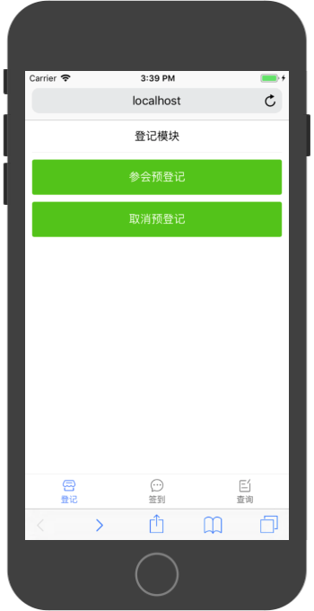
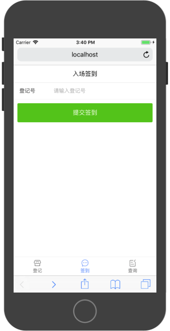
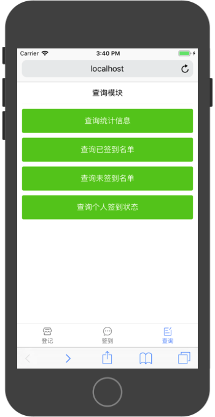

登记模块中分为参会登记和取消登记两个功能。

以下为参加登记功能演示：

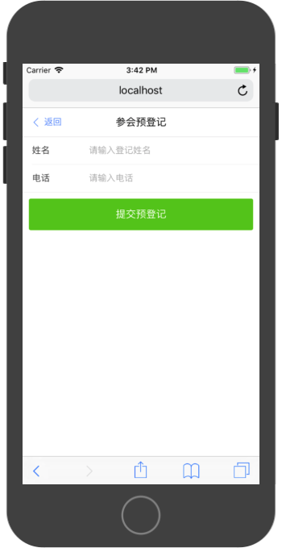
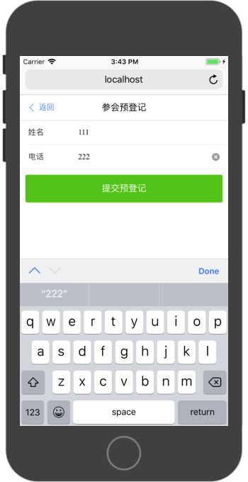
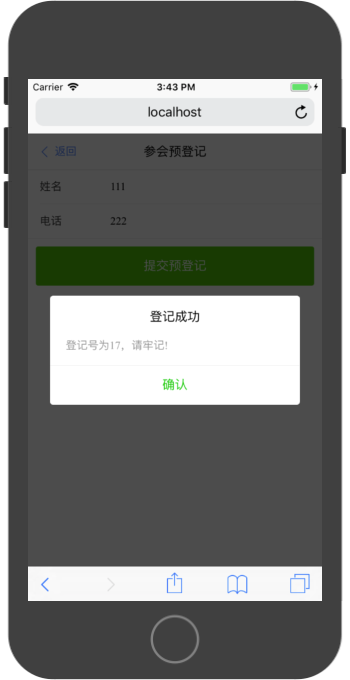

以下为取消登记功能演示：

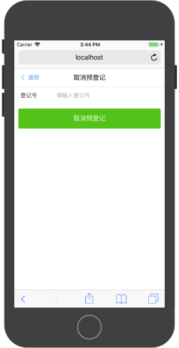

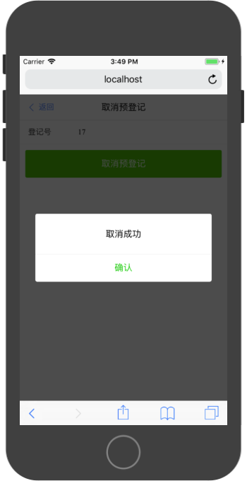

签到模块演示：

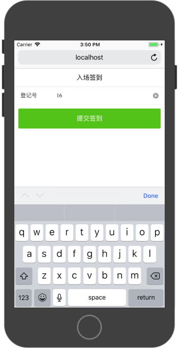
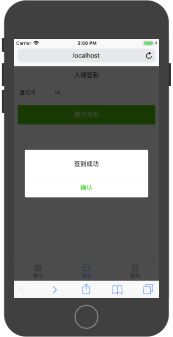

查询模块分为以下功能：

* 查询统计信息
* 查询已签到名单
* 查询未签到名单
* 查询个人签到状态

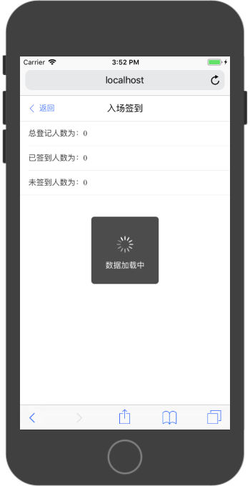
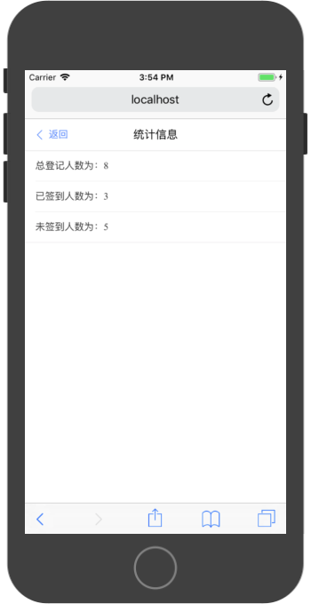
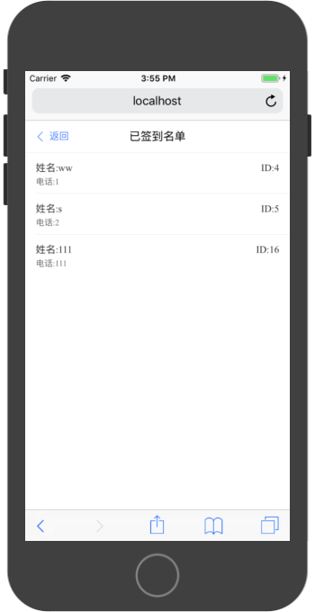
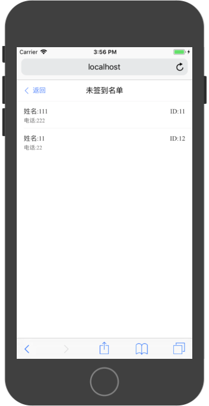
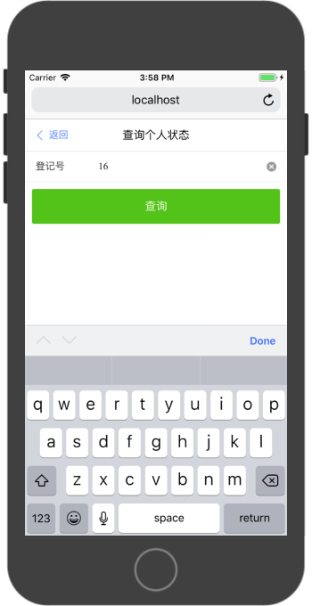
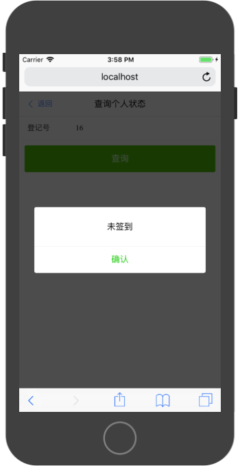

### API接口

**元数据**

|字段名|类型|描述|
|:---|:---|:---|
|id|int|唯一且自增，由数据库维护，作为参会登记号|
|name|string|参会者姓名|
|tel|string|参数者电话|
|isCheck|int|是否签到。0-未签到，1-已签到，默认未签到|


**错误列表**

|错误编号|描述|
|:---|:---|
|10001|数据库错误|
|10002|rid无效|

```
{
    success:false,
    errorCode:10001,
    errorMessage:'数据库错误'
}
```


**参会登记**

请求路径： `http://ip:port/api/register`

请求方式：`POST`

请求参数：

|字段名|类型|描述|
|:---|:---|:---|
|name|string|参会者姓名|
|tel|string|参数者电话|


返回值：

```
{
    success:true,
    data:{
        id:1,
        name:'xx',
        tel:'123',
        isCheck:0
    }
}
```

**取消登记**

请求路径： `http://ip:port/api/unRegister`

请求方式：`POST`

请求参数：

|字段名|类型|描述|
|:---|:---|:---|
|rid|string|参会者登记号|


返回值：

```
{
    success:true,
}
```

**签到**

请求路径： `http://ip:port/api/check`

请求方式：`POST`

请求参数：

|字段名|类型|描述|
|:---|:---|:---|
|rid|string|参会者登记号|


返回值：

```
{
    success:true,
}
```

**查询统计信息**

请求路径： `http://ip:port/api/tongji`

请求方式：`GET`

请求参数：无


返回值：

```
{
    success:true,
    data:{
        total:10,
        checked:3,
        unCheck:7,
    }
}
```

**查询已签到名单**

请求路径： `http://ip:port/api/yiqiandao`

请求方式：`GET`

请求参数：无


返回值：

```
{
    success:true,
    data:[
        {
            id:1,
            name:'xx',
            tel:'123',
            isCheck:1
        },
        ...
    ]
}
```


**查询未签到名单**

请求路径： `http://ip:port/api/weiqiandao`

请求方式：`GET`

请求参数：无


返回值：

```
{
    success:true,
    data:[
        {
            id:1,
            name:'xx',
            tel:'123',
            isCheck:0
        },
        ...
    ]
}
```

**查询个人签到状态**

请求路径： `http://ip:port/api/checkPerson`

请求方式：`POST`

请求参数：

|字段名|类型|描述|
|:---|:---|:---|
|rid|string|参会者登记号|


返回值：

```
{
    success:true,
    data:{
        id:1,
        name:'xx',
        tel:'123',
        isCheck:0
    }
}
```

### 数据服务层构建

构造一个`MeetingManager`数据服务对象对上层Screen对象支撑数据操作。该数据服务对象具有如下功能：

* 参会登记
* 取消登记
* 签到
* 查询统计信息
* 查询已签到名单
* 查询未签到名单
* 查询个人签到状态

1，构造`URLConfig.js`文件

```
const host = 'http://60.205.141.116:';
const port = 60001;

const registerURL = host + port + '/api/register';
const unRegisterURL = host + port + '/api/unRegister';
const checkURL = host + port + '/api/check';
const chaxuTongjiURL = host + port + '/api/tongji';
const yiqiandaoURL = host + port + '/api/yiqiandao';
const weiqiandaoURL = host + port + '/api/weiqiandao';
const checkPersonURL = host + port + '/api/checkPerson'

export {
    registerURL,
    unRegisterURL,
    checkURL,
    chaxuTongjiURL,
    yiqiandaoURL,
    weiqiandaoURL,
    checkPersonURL
}
```

2，构建MeetingManager对象：

```
import  {
    registerURL,
    unRegisterURL,
    checkURL,
    chaxuTongjiURL,
    yiqiandaoURL,
    weiqiandaoURL,
    checkPersonURL
} from './URLConfig';

class MeetingManager {

    async register(name,tel){
        try {
            const person = {
                name,
                tel
            }
            const res = await fetch(registerURL,{
                method:'POST',
                headers:{
                    'Accept':'application/json',
                    'Content-Type':'application/json'
                },
                body:JSON.stringify(person)
            })
            const result = await res.json();
            return result;
        } catch (error){
            return {
                success:false,
                errorCode:10001,
                errorMessage:`${error}`
            }
        }
    }

    async unRegister(rid){

         try {
            const params = {
                rid
            }

            const res = await fetch(unRegisterURL,{
                method:'POST',
                headers:{
                    'Accept':'application/json',
                    'Content-Type':'application/json'
                },
                body:JSON.stringify(params)
            })

            const result = await res.json();

            return result;

        } catch (error) {
            return {
                success:false,
                errorCode:10001,
                errorMessage:`${error}`
            }
        }
    }

    async check(rid){
         try {
            const person = {
                rid
            }

            const res = await fetch(checkURL,{
                method:'POST',
                headers:{
                    'Accept':'application/json',
                    'Content-Type':'application/json'
                },
                body:JSON.stringify(person)
            })

            const result = await res.json();
            return result;

        } catch (error) {
            return {
                success:false,
                errorCode:10001,
                errorMessage:`${error}`
            }
        }
    }

    async chaxuTongji(){
        try {
            const res = await fetch(chaxuTongjiURL)
            const result = await res.json();
           return result;

       } catch (error) {
           return {
               success:false,
               errorCode:10001,
               errorMessage:`${error}`
           }
       }
       
   }

    async yiqiandao (){
        try {
            const res = await fetch(yiqiandaoURL)
            const result = await res.json();
            return result;

        } catch (error) {
            return {
                success:false,
                errorCode:10001,
                errorMessage:`${error}`
            }
        }
    }

    async weiqiandao (){
        try {
            const res = await fetch(weiqiandaoURL)
            const result = await res.json();
            return result;

        } catch (error) {
            return {
                success:false,
                errorCode:10001,
                errorMessage:`${error}`
            }
        }
    }

    async checkPerson(rid){
        try {
            const person = {
                rid:this.state.rid
            }

            const res = await fetch(checkPersonURL,{
                method:'POST',
                headers:{
                    'Accept':'application/json',
                    'Content-Type':'application/json'
                },
                body:JSON.stringify(person)
            })

            const result = await res.json();

            return result;

        } catch (error) {
            return {
                success:false,
                errorCode:10001,
                errorMessage:`${error}`
            }
        }
    }
}

export default new MeetingManager;
```

### Screen导航路由配置

1，构建TabBarScreen

WebApp初始加载TabbarScreen，由该Screen对象管理如下三个Screen对象的切换状态

* RegisterScreen
* CheckInScreen
* QuaryScreen

在TabbarScreen的template中，根据`active`的值，通过`v-if`指令控制其显示状态

```
<div>
    <RegisterScreen v-if="active === 0" />
    <CheckInScreen v-if="active === 1" />
    <QuaryScreen v-if="active === 2" />
</div>
```

`active`的值由`van-tabbar`组件进行控制

```
<van-tabbar v-model="active">
    <van-tabbar-item icon="shop">登记</van-tabbar-item>
    <van-tabbar-item icon="chat">签到</van-tabbar-item>
    <van-tabbar-item icon="records">查询</van-tabbar-item>
</van-tabbar>
```

完整template的实现为：

```
<template>
    <div>
        <RegisterScreen v-if="active === 0" />
        <CheckInScreen v-if="active === 1" />
        <QuaryScreen v-if="active === 2" />
        <van-tabbar v-model="active">
            <van-tabbar-item icon="shop">登记</van-tabbar-item>
            <van-tabbar-item icon="chat">签到</van-tabbar-item>
            <van-tabbar-item icon="records">查询</van-tabbar-item>
        </van-tabbar>
    </div>
</template>
```


在script表情中，需要定义一个`active`数据，并引入以上三个Screen对象进行注册

```
<script>

import RegisterScreen from './RegisterScreen'
import CheckInScreen from './CheckInScreen'
import QuaryScreen from './QuaryScreen'

export default {
    name: 'tabbar',
    components: {
        RegisterScreen,
        CheckInScreen,
        QuaryScreen,
    },
    data: function() {
        return (
            {
                active: 0,
            }
        )
    }
}
</script>
```

同时，需要使用本地储存对象`localStorage`对`active`的值进行缓存。在页面加载时判断`localStorage`是否存有`active`的值，如存有，为其赋值。当`active`的值发生变化时，将`active`的值写入localStorage`中进行保存。

```
watch:{
    active:function(active){
        console.log(active)
        localStorage.active = active;
    }
},
mounted:function(){
    if(localStorage.active){
        this.active = parseInt(localStorage.active);
        console.log(this.active)
    }
}
```

完成script实现代码：

```
<script>

import RegisterScreen from './RegisterScreen'
import CheckInScreen from './CheckInScreen'
import QuaryScreen from './QuaryScreen'

export default {
    name: 'tabbar',
    components: {
        RegisterScreen,
        CheckInScreen,
        QuaryScreen,
    },
    data: function() {
        return (
            {
                active: 0,
            }
        )
    },
    watch:{
        active:function(active){
            console.log(active)
            localStorage.active = active;
        }
    },
    mounted:function(){
        if(localStorage.active){
            this.active = parseInt(localStorage.active);
            console.log(this.active)
        }
    }
}
</script>
```

2，构建Screen对象路由表

此WebApp中，除去TabBarScreen中包含的3个Screen外，还有6个Screen对象，需要通过路由表将其访问路径做规划：

* TabBarScreen，访问路径为`/`
* MeetingRegisterScreen，访问路径为`/MeetingRegisterScreen`
* CancelRegisterScreen，访问路径为`/CancelRegisterScreen`
* WeiqiandaoScreen，访问路径为`/WeiqiandaoScreen`
* YiqiandaoScreen，访问路径为`/YiqiandaoScreen`
* GerenScreen，访问路径为`/GerenScreen`
* TongjiScreen，访问路径为`/TongjiScreen`

路由表实现代码：

```
import Vue from 'vue'
import Router from 'vue-router'

import TabBarScreen from './Screen/TabBarScreen.vue'
import MeetingRegisterScreen from './Screen/MeetingRegisterScreen.vue'
import CancelRegisterScreen from './Screen/CancelRegisterScreen.vue'
import TongjiScreen from './Screen/TongjiScreen.vue'
import WeiqiandaoScreen from './Screen/WeiqiandaoScreen.vue'
import YiqiandaoScreen from './Screen/YiqiandaoScreen.vue'
import GerenScreen from './Screen/GerenScreen.vue'


Vue.use(Router)

export default new Router({
  routes: [
    {
      path: '/',
      name: 'TabBarScreen',
      component: TabBarScreen
    },
    {
      path: '/MeetingRegisterScreen',
      name: 'MeetingRegisterScreen',
      component: MeetingRegisterScreen
    },
    {
      path: '/CancelRegisterScreen',
      name: 'CancelRegisterScreen',
      component: CancelRegisterScreen
    },
    {
      path: '/TongjiScreen',
      name: 'TongjiScreen',
      component: TongjiScreen
    },
    {
      path: '/WeiqiandaoScreen',
      name: 'WeiqiandaoScreen',
      component: WeiqiandaoScreen
    },
    {
      path: '/YiqiandaoScreen',
      name: 'YiqiandaoScreen',
      component: YiqiandaoScreen
    },
    {
      path: '/GerenScreen',
      name: 'GerenScreen',
      component: GerenScreen
    },
  ]
})

```

3，main.js中加载路由表

```
import Vue from 'vue'
import App from './App.vue'
import router from './router'

import Vant from 'vant'
import 'vant/lib/vant-css/index.css'

Vue.use(Vant)

Vue.config.productionTip = false

new Vue({
  router,
  render: h => h(App)
}).$mount('#app')
```

4，App.vue中渲染一个`router-view`组件，以来根据访问路径显示相应的Screen

```
<template>
  <div id="app">
    <router-view/>
  </div>
</template>
```

### Screen对象实现

在Screen对象实现过程中，主要是用Vant组件库和Manager对象，通过组件库中的组件构建页面，通过Manager对象处理数据操作。

1，登记模块 RegisterScreen

```
<template>
    <div id="root">
        <van-nav-bar fiexd title="登记模块" />
        <van-button 
            class="btn" 
            size="large" 
            type="primary" 
            @click="meetingRegister"
        >参会预登记</van-button>
        <van-button 
            class="btn" 
            size="large" 
            type="primary"
            @click="cancelRegister"
        >取消预登记</van-button>
    </div>
</template>

<script>
export default {
    name: 'register',
    methods: {
        meetingRegister: function() {
            this.$router.push('MeetingRegisterScreen');
        },
        cancelRegister: function() {
            this.$router.push('CancelRegisterScreen');
        }
    }
}
</script>


<style>
#root {
    padding-right: 10px;
    padding-left: 10px;
}

.btn {
    margin-top: 10px;
}
</style>

```

2，签到模块 CheckInScreen

```
<template>
    <div>
        <van-nav-bar 
            fiexd 
            title="入场签到" 
            @click-left="onClickLeft"
        />
        <van-cell-group>
            <van-field
                v-model="rid"
                clearable
                label="登记号"
                placeholder="请输入登记号"
            />
        </van-cell-group>
        <div style="padding:10px">
            <van-button  
                size="large" 
                type="primary" 
                @click="checkin"
            >提交签到</van-button>
        </div>
    </div>
</template>

<script>

import { 
    Dialog,
    Toast
} from 'vant';

import meetingManager from '../DataServe/MeetingManager';

export default {
  name:'CheckIn',
  data:function(){
      return(
          {
              rid:'',
          }
      )
  },
  methods:{
      onClickLeft:function(){
          this.$router.go(-1);
      },
      checkin:async function(){
          const result = await meetingManager.check(this.rid);
          console.log(result);
          if(result.success === false){
              Toast.fail(result.errorMessage);
              return;
          }

        Dialog.alert({
            title: '签到成功'
        })
      }
  }
}
</script>
```

3，查询模块 QuaryScreen

```
<template>
    <div id="root">
        <van-nav-bar 
            fiexd 
            title="查询模块" 
        />
        <van-button 
            class="btn" 
            size="large" 
            type="primary" 
            @click="tongji"
        >查询统计信息</van-button>
        <van-button 
            class="btn" 
            size="large" 
            type="primary"
            @click="yiqiando"
        >查询已签到名单</van-button>
        <van-button 
            class="btn" 
            size="large" 
            type="primary" 
            @click="weiqiandao"
        >查询未签到名单</van-button>
        <van-button 
            class="btn" 
            size="large" 
            type="primary"
            @click="geren"
        >查询个人签到状态</van-button>
    </div>
</template>

<script>
export default {
    name: 'quary',
    methods:{
        tongji:function(){
            this.$router.push('TongjiScreen');
        },
        yiqiando:function(){
            this.$router.push('YiqiandaoScreen');
        },
        weiqiandao:function(){
            this.$router.push('WeiqiandaoScreen');
        },
        geren:function(){
            this.$router.push('GerenScreen');
        },
    }
}
</script>


<style>
#root {
    padding-right: 10px;
    padding-left: 10px;
}

.btn {
    margin-top: 10px;
}
</style>

```

4，参会预登记 MeetingRegisterScreen

```
<template>
    <div>
        <van-nav-bar 
            fiexd 
            title="参会预登记" 
            left-text="返回"
            left-arrow
            @click-left="onClickLeft"
        />
        <van-cell-group>
            <van-field
                v-model="name"
                clearable
                label="姓名"
                placeholder="请输入登记姓名"
            />
            <van-field
                v-model="tel"
                clearable
                label="电话"
                placeholder="请输入电话"
            />
        </van-cell-group>
        <div style="padding:10px">
            <van-button  
                size="large" 
                type="primary" 
                @click="register"
            >提交预登记</van-button>
        </div>
    </div>
</template>


<script>

import { 
    Dialog,
    Toast
} from 'vant';

import meetingManager from '../DataServe/MeetingManager';

export default {
  name:'MeetingRegister',
  data:function(){
      return(
          {
              name:'',
              tel:''
          }
      )
  },
  methods:{
      onClickLeft:function(){
          this.$router.go(-1);
      },
      register:async function(){
          const result = await meetingManager.register(this.name,this.tel);
          console.log(result);
          if(result.success === false){
              Toast.fail(result.errorMessage);
              return;
          }

        Dialog.alert({
            title: '登记成功',
            message: `登记号为${result.data.id}，请牢记!`
        })
      }
  }
}
</script>


```

5，取消预登记 CancelRegisterScreen

```
<template>
    <div>
        <van-nav-bar 
            fiexd 
            title="取消预登记" 
            left-text="返回"
            left-arrow
            @click-left="onClickLeft"
        />
        <van-cell-group>
            <van-field
                v-model="rid"
                clearable
                label="登记号"
                placeholder="请输入登记号"
            />
        </van-cell-group>
        <div style="padding:10px">
            <van-button  
                size="large" 
                type="primary" 
                @click="cancel"
            >取消预登记</van-button>
        </div>
    </div>
</template>

<script>

import { 
    Dialog,
    Toast
} from 'vant';

import meetingManager from '../DataServe/MeetingManager';

export default {
  name:'CancelRegister',
  data:function(){
      return(
          {
              rid:'',
          }
      )
  },
  methods:{
      onClickLeft:function(){
          this.$router.go(-1);
      },
      cancel:async function(){
          const result = await meetingManager.unRegister(this.rid);
          console.log(result);
          if(result.success === false){
              Toast.fail(result.errorMessage);
              return;
          }

        Dialog.alert({
            title: '取消成功',
        })
      }
  }
}
</script>
```

6，查询统计信息 TongjiScreen

```
<template>
    <div>
        <van-nav-bar 
            fiexd 
            title="统计信息" 
            @click-left="onClickLeft"
            left-text="返回"
            left-arrow
        />
        <van-cell-group>
            <van-cell :title="`总登记人数为：${total}`" />
            <van-cell :title="`已签到人数为：${checked}`" />
            <van-cell :title="`未签到人数为：${unChecked}`" />
        </van-cell-group>
    </div>
</template>

<script>

import { 
    Toast
} from 'vant';

import meetingManager from '../DataServe/MeetingManager';

export default {
  name:'TongjiScreen',
  data:function(){
      return(
          {
              total:0,
              checked:0,
              unChecked:0
          }
      )
  },
  methods:{
      onClickLeft:function(){
          this.$router.go(-1);
      },
  },
  mounted:async function(){

        Toast.loading({
            duration: 0,       // 持续展示 toast
            forbidClick: true, // 禁用背景点击
            loadingType: 'spinner',
            message: '数据加载中'
        });

        const result = await meetingManager.chaxuTongji();
        Toast.clear();
        console.log(result);
        if(result.success === false){
            Toast.fail(result.errorMessage);
            return;
        }

        const { total,checked,unChecked } = result.data;
        this.total = total;
        this.checked = checked;
        this.unChecked = unChecked;
        
  }
}
</script>
```

7，查询已签到名单 YiqiandaoScreen

```
<template>
    <div>
        <van-nav-bar 
            fiexd 
            title="已签到名单" 
            @click-left="onClickLeft"
            left-text="返回"
            left-arrow
        />
        <van-cell 
            v-for="person in list"
            :key="person.id"
            :title="'姓名:'+person.name" 
            :value="'ID:'+person.id" 
            :label="'电话:'+person.tel" 
        />
    </div>
</template>

<script>

import { 
    Toast
} from 'vant';

import meetingManager from '../DataServe/MeetingManager';

export default {
  name:'YiqiandaoScreen',
  data:function(){
      return(
          {
              list:[]
          }
      )
  },
  methods:{
      onClickLeft:function(){
          this.$router.go(-1);
      },
  },
  mounted:async function(){

        Toast.loading({
            duration: 0,       // 持续展示 toast
            forbidClick: true, // 禁用背景点击
            loadingType: 'spinner',
            message: '数据加载中'
        });

        const result = await meetingManager.yiqiandao();
        Toast.clear();
        console.log(result);
        if(result.success === false){
            Toast.fail(result.errorMessage);
            return;
        }

        this.list = result.data;
        
  }
}
</script>
```

8，查询未签到名单 WeiqiandaoScreen

```
<template>
    <div>
        <van-nav-bar 
            fiexd 
            title="未签到名单" 
            @click-left="onClickLeft"
            left-text="返回"
            left-arrow
        />
        <van-cell 
            v-for="person in list"
            :key="person.id"
            :title="'姓名:'+person.name" 
            :value="'ID:'+person.id" 
            :label="'电话:'+person.tel" 
        />
    </div>
</template>

<script>

import { 
    Toast
} from 'vant';

import meetingManager from '../DataServe/MeetingManager';

export default {
  name:'WeiqiandaoScreen',
  data:function(){
      return(
          {
              list:[]
          }
      )
  },
  methods:{
      onClickLeft:function(){
          this.$router.go(-1);
      },
  },
  mounted:async function(){

        Toast.loading({
            duration: 0,       // 持续展示 toast
            forbidClick: true, // 禁用背景点击
            loadingType: 'spinner',
            message: '数据加载中'
        });

        const result = await meetingManager.weiqiandao();
        Toast.clear();
        console.log(result);
        if(result.success === false){
            Toast.fail(result.errorMessage);
            return;
        }

        this.list = result.data;
        
  }
}
</script>
```

9，查询个人签到状态 GerenScreen

```
<template>
    <div>
        <van-nav-bar 
            fiexd 
            title="查询个人状态" 
            left-text="返回"
            left-arrow
            @click-left="onClickLeft"
        />
        <van-cell-group>
            <van-field
                v-model="rid"
                clearable
                label="登记号"
                placeholder="请输入登记号"
            />
        </van-cell-group>
        <div style="padding:10px">
            <van-button  
                size="large" 
                type="primary" 
                @click="check"
            >查询</van-button>
        </div>
    </div>
</template>

<script>

import { 
    Dialog,
    Toast
} from 'vant';

import meetingManager from '../DataServe/MeetingManager';

export default {
  name:'CheckIn',
  data:function(){
      return(
          {
              rid:'',
          }
      )
  },
  methods:{
      onClickLeft:function(){
          this.$router.go(-1);
      },
      check:async function(){
          console.log(this.rid);
          const result = await meetingManager.checkPerson(this.rid);
          console.log(result);
          if(result.success === false){
              Toast.fail(result.errorMessage);
              return;
          }

        Dialog.alert({
            title: result.data.check?'已签到':'未签到'
        })
      }
  }
}
</script>
```