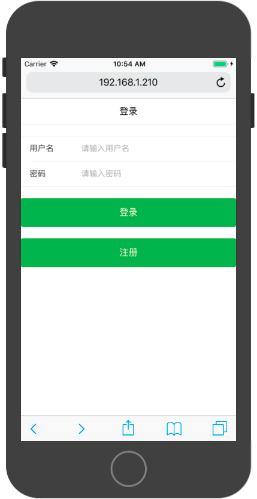
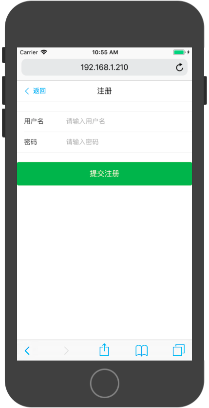
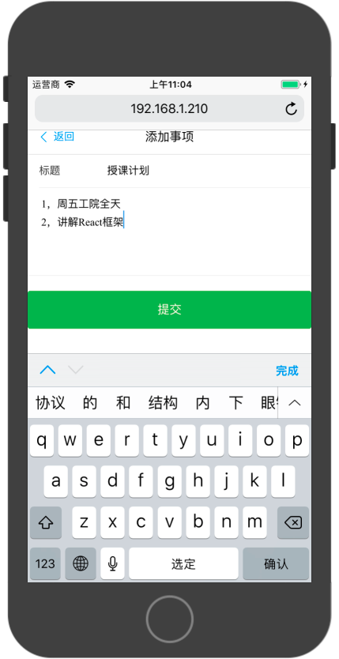
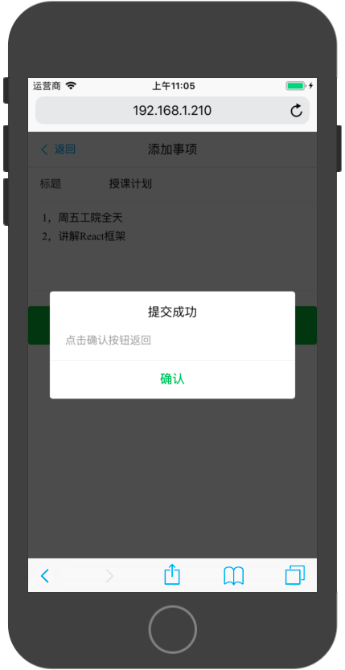
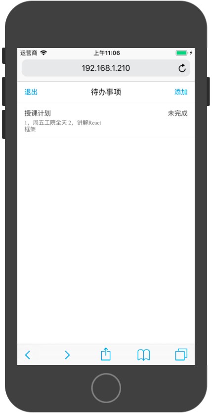
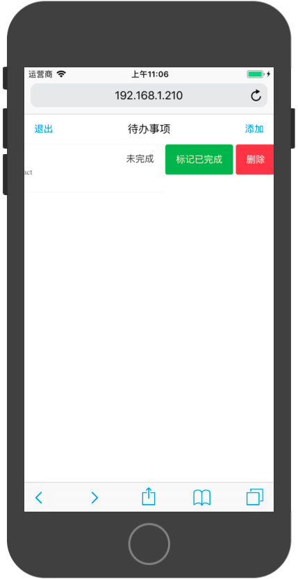
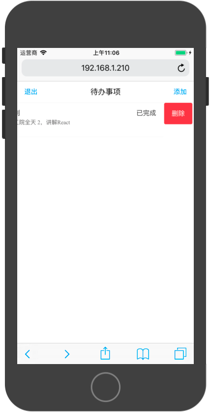

# 项目4：备忘录

### 产品原型

登录注册模块：

提供用户登录和注册功能





事项管理模块：

提供发布代办事项、展示代办事项、删除代办事项和标记代办事项已完成功能。








### API文档

**元数据**

账户对象

```
{
	id:0
	username:'',
	password:'',
	access_token:'',
}
```

Todo条目对象

```
{
	id:0
	title:'',
	content:'',
	isFinish:true OR false,
}
```

**错误代码**

|错误代码|内容|
|:---|:---|
|10001|系统错误|
|10002|用户名错误|
|10003|密码错误|
|10004|access_token无效|
|10005|TodoID无效|
|10006|参数无效|
|10007|用户名已存在|

错误返回值：

```
{
    success:false,
    errorCode:10001,
    errorMessage:'系统错误'
}
```


**接口服务**

请求基础地址

`http://localhost:5000`

注册

请求链接：`/api/register`

请求方式：`POST`

|参数名称|参数描述|
|:---|:---|
|username|用户名|
|password|密码|

```
{
    "success": true,
    "data": {
        "id": 2,
        "username": "tom1",
        "password": "1234",
        "access_token": "16e088f3d62c4c132e8728ef79eaf353",
        "updatedAt": "2018-06-06T08:05:13.664Z",
        "createdAt": "2018-06-06T08:05:13.664Z"
    }
}
```

登录

请求链接：`/api/login`

请求方式：`POST`

|参数名称|参数描述|
|:---|:---|
|username|账户名|
|password|密码|

```
{
    "success": true,
    "data": {
        "id": 2,
        "username": "tom1",
        "password": "1234",
        "access_token": "8e58260409dc169009b87800dfe5128f",
        "createdAt": "2018-06-06T08:05:13.000Z",
        "updatedAt": "2018-06-06T08:11:18.442Z"
    }
}

```

提交备忘录条目

请求链接：`/api/postTodoItem`

请求方式：`POST`

|参数名称|参数描述|
|:---|:---|
|access_token|登录令牌|
|title|标题|
|content|内容|

```
{
    "success": true,
    "data": 
}

```

修改备忘录条目：

请求链接：`/api/updateTodoItem`

请求方式：`POST`

|参数名称|参数描述|
|:---|:---|
|access_token|登录令牌|
|id|条目ID|
|title|标题（可选）|
|content|内容（可选）|

```
{
    "success": true,
    "data": 
}

```

切换标记备忘录条目完成状态

请求链接：`/api/finishTodoItem`

请求方式：`POST`

|参数名称|参数描述|
|:---|:---|
|access_token|登录令牌|
|id|条目ID|

```
{
    "success": true,
    "data": 
}

```

删除备忘录条目

请求链接：`/api/deleteTodoItems`

请求方式：`POST`

|参数名称|参数描述|
|:---|:---|
|access_token|登录令牌|
|id|条目ID|

```
{
    "success": true,
}
```

### 数据服务层构建

1，安装API文档中的接口路径，构建`URLConfig.js`文件：

```
const host = 'http://localhost:';
const port = 5000;

const loginURL = host+port+'/api/login';
const registerURL = host+port+'/api/register';
const postTodoItemURL = host+port+'/api/postTodoItem';
const updateTodoItemURL = host+port+'/api/updateTodoItem';
const deleteTodoItemURL = host+port+'/api/deleteTodoItem';
const getTodoItemsURL = host+port+'/api/getTodoItems';
const finishTodoItemURL = host+port+'/api/finishTodoItem';

export {
    loginURL,
    registerURL,
    postTodoItemURL,
    updateTodoItemURL,
    deleteTodoItemURL,
    getTodoItemsURL,
    finishTodoItemURL
}
```


2，构建`UserManager`数据服务对象，对用户相关操作进行封装。该数据对象提供以下功能支撑：

* 用户注册（异步）
* 用户登录（异步）
* 保持登录信息
* 查询当前登录状态
* 登出操作（清空登录信息）

构建`UserManager`单例：

```
import { loginURL,registerURL } from './URLConfig';

class UserManager {

}

export default new UserManager();
```

构建注册功能模块。该模块通过控制器传入的用户名和密码向API发起网络请求，将用户名和密码提交给服务器，服务器通过业务系统进行处理，返回注册结果。如注册成功，该模块内使用`localStorage`对`access_token`登录令牌进行本地保存，以维持登录状态。并返回登录结果。

```
async register(username,password){
    try {
        const user = {
            username,
            password
        }

        const res = await fetch(registerURL,{
            method:'POST',
            headers:{
                'Accept':'application/json',
                'Content-Type':'application/json'
            },
            body:JSON.stringify(user)
        });

        const result = await res.json();

        if(result.success === true){
            localStorage.access_token = result.data.access_token 
        }

        return result;

    } catch (error) {
        return {
            success:false,
            errorMessage:'网络错误'
        }
    }
}
```

构建登录功能模块。该模块通过控制器传入的用户名和密码向API发起网络请求，将用户名和密码提交给服务器，服务器通过业务系统进行处理，返回注册结果。如注册成功，该模块内使用`localStorage`对`access_token`登录令牌进行本地保存，以维持登录状态。并返回登录结果。

```
async login(username,password){
    try {
        const user = {
            username,
            password
        }

        const res = await fetch(loginURL,{
            method:'POST',
            headers:{
                'Accept':'application/json',
                'Content-Type':'application/json'
            },
            body:JSON.stringify(user)
        });

        const result = await res.json();

        if(result.success === true){
            localStorage.access_token = result.data.access_token 
        }

        return result;

    } catch (error) {
        return {
            success:false,
            errorMessage:'网络错误'
        }
    }
}
```

构建查询登录状态功能模块。通过判断`localStorage`中`access_token`的值的情况，如果其值为空或者`''`空字符串，就表示当前为登出状态。

```
isLogin(){
    if(localStorage.access_token === '' || !localStorage.access_token){
        return false;
    } else {
        return true;
    }
}
```

构建登出功能。在该功能中对`localStorage`中`access_token`的值进行清除操作。

```
logout(){
    localStorage.access_token = '';
}
```

完整参考代码：

```
import { loginURL,registerURL } from './URLConfig';

class UserManager {
    
    async login(username,password){
        try {
            const user = {
                username,
                password
            }

            const res = await fetch(loginURL,{
                method:'POST',
                headers:{
                    'Accept':'application/json',
                    'Content-Type':'application/json'
                },
                body:JSON.stringify(user)
            });

            const result = await res.json();

            if(result.success === true){
                localStorage.access_token = result.data.access_token 
            }

            return result;

        } catch (error) {
            return {
                success:false,
                errorMessage:'网络错误'
            }
        }
    }

    logout(){
        localStorage.access_token = '';
    }

    isLogin(){
        if(localStorage.access_token === '' || !localStorage.access_token){
            return false;
        } else {
            return true;
        }
    }

    async register(username,password){
        try {
            const user = {
                username,
                password
            }

            const res = await fetch(registerURL,{
                method:'POST',
                headers:{
                    'Accept':'application/json',
                    'Content-Type':'application/json'
                },
                body:JSON.stringify(user)
            });

            const result = await res.json();

            if(result.success === true){
                localStorage.access_token = result.data.access_token 
            }

            return result;

        } catch (error) {
            return {
                success:false,
                errorMessage:'网络错误'
            }
        }
    }

}

export default new UserManager();

```

3，构建待办事项数据管理对象，该对象提供以下功能支撑：

* 发布待办事项（异步）
* 删除待办事项（异步）
* 修改待办事项（异步）
* 维护待办事项完成状态（异步）
* 获取当前用户下的所有待办事项（异步）

构建`TodoManager`单例对象：

```
import {
    postTodoItemURL,
    updateTodoItemURL,
    deleteTodoItemURL,
    getTodoItemsURL,
    finishTodoItemURL
} from './URLConfig';

class TodoManager {

}

export default new TodoManager();
```

构建发布待办事项功能模块。

```
async postTodo(title,content){
    try {
        const todo = {
            access_token:localStorage.access_token,
            title,
            content
        }

        const res = await fetch(postTodoItemURL,{
            method:'POST',
            headers:{
                'Accept':'application/json',
                'Content-Type':'application/json'
            },
            body:JSON.stringify(todo)
        });

        const result = await res.json();

        return result;

    } catch (error) {
        return {
            success:false,
            errorMessage:'网络错误'
        }
    }
}
```

构建删除待办事项功能模块：

```
async deleteTodo(id){
    try {
        const todo = {
            access_token:localStorage.access_token,
            id,
        }

        const res = await fetch(deleteTodoItemURL,{
            method:'POST',
            headers:{
                'Accept':'application/json',
                'Content-Type':'application/json'
            },
            body:JSON.stringify(todo)
        });

        const result = await res.json();

        return result;

    } catch (error) {
        return {
            success:false,
            errorMessage:'网络错误'
        }
    }
}
```

构建修改待办事项的功能模块：

```
async updateTodo(id,title,content){
    try {
        const todo = {
            access_token:localStorage.access_token,
            id,
            title,
            content
        }

        const res = await fetch(updateTodoItemURL,{
            method:'POST',
            headers:{
                'Accept':'application/json',
                'Content-Type':'application/json'
            },
            body:JSON.stringify(todo)
        });

        const result = await res.json();

        return result;

    } catch (error) {
        return {
            success:false,
            errorMessage:'网络错误'
        }
    }
}
```

构建标记待办事项完成的功能模块：

```
async finishTodo(id){
    try {
        const todo = {
            access_token:localStorage.access_token,
            id,
        }

        const res = await fetch(finishTodoItemURL,{
            method:'POST',
            headers:{
                'Accept':'application/json',
                'Content-Type':'application/json'
            },
            body:JSON.stringify(todo)
        });

        const result = await res.json();

        return result;

    } catch (error) {
        return {
            success:false,
            errorMessage:'网络错误'
        }
    }
}
```

构建获取当前用户下所有代待办事项的功能模块：

```
async getTodos(){
    try {
        const todo = {
            access_token:localStorage.access_token,
        }

        const res = await fetch(getTodoItemsURL,{
            method:'POST',
            headers:{
                'Accept':'application/json',
                'Content-Type':'application/json'
            },
            body:JSON.stringify(todo)
        });

        const result = await res.json();

        return result;

    } catch (error) {
        return {
            success:false,
            errorMessage:'网络错误'
        }
    }
}
```

完整实现代码：

```
import {
    postTodoItemURL,
    updateTodoItemURL,
    deleteTodoItemURL,
    getTodoItemsURL,
    finishTodoItemURL
} from './URLConfig';

class TodoManager {

    async postTodo(title,content){
        try {
            const todo = {
                access_token:localStorage.access_token,
                title,
                content
            }

            const res = await fetch(postTodoItemURL,{
                method:'POST',
                headers:{
                    'Accept':'application/json',
                    'Content-Type':'application/json'
                },
                body:JSON.stringify(todo)
            });

            const result = await res.json();

            return result;

        } catch (error) {
            return {
                success:false,
                errorMessage:'网络错误'
            }
        }
    }

    async updateTodo(id,title,content){
        try {
            const todo = {
                access_token:localStorage.access_token,
                id,
                title,
                content
            }

            const res = await fetch(updateTodoItemURL,{
                method:'POST',
                headers:{
                    'Accept':'application/json',
                    'Content-Type':'application/json'
                },
                body:JSON.stringify(todo)
            });

            const result = await res.json();

            return result;

        } catch (error) {
            return {
                success:false,
                errorMessage:'网络错误'
            }
        }
    }

    async deleteTodo(id){
        try {
            const todo = {
                access_token:localStorage.access_token,
                id,
            }

            const res = await fetch(deleteTodoItemURL,{
                method:'POST',
                headers:{
                    'Accept':'application/json',
                    'Content-Type':'application/json'
                },
                body:JSON.stringify(todo)
            });

            const result = await res.json();

            return result;

        } catch (error) {
            return {
                success:false,
                errorMessage:'网络错误'
            }
        }
    }

    async finishTodo(id){
        try {
            const todo = {
                access_token:localStorage.access_token,
                id,
            }

            const res = await fetch(finishTodoItemURL,{
                method:'POST',
                headers:{
                    'Accept':'application/json',
                    'Content-Type':'application/json'
                },
                body:JSON.stringify(todo)
            });

            const result = await res.json();

            return result;

        } catch (error) {
            return {
                success:false,
                errorMessage:'网络错误'
            }
        }
    }

    async getTodos(){
        try {
            const todo = {
                access_token:localStorage.access_token,
            }

            const res = await fetch(getTodoItemsURL,{
                method:'POST',
                headers:{
                    'Accept':'application/json',
                    'Content-Type':'application/json'
                },
                body:JSON.stringify(todo)
            });

            const result = await res.json();

            return result;

        } catch (error) {
            return {
                success:false,
                errorMessage:'网络错误'
            }
        }
    }
}

export default new TodoManager();
```


### 构建页面路由

1，此WebApp中包含的4个Screen，需要通过路由表将其访问路径做规划：

* HomeScreen，访问路径为`/`
* LoginScreen，访问路径为`/LoginScreen`
* RegisterScreen，访问路径为`/RegisterScreen`
* CreateTodoScreen，访问路径为`/CreateTodoScreen`

路由表实现代码：

```
import Vue from 'vue'
import Router from 'vue-router'


import LoginScreen from './Screen/LoginScreen.vue'
import RegisterScreen from './Screen/RegisterScreen.vue'
import HomeScreen from './Screen/HomeScreen.vue'
import CreateTodoScreen from './Screen/CreateTodoScreen.vue'

Vue.use(Router)

export default new Router({
  routes: [
    {
      path: '/',
      name: 'HomeScreen',
      component: HomeScreen
    },
    {
      path: '/LoginScreen',
      name: 'LoginScreen',
      component: LoginScreen
    },
    {
      path: '/RegisterScreen',
      name: 'RegisterScreen',
      component: RegisterScreen
    },
    {
      path: '/CreateTodoScreen',
      name: 'CreateTodoScreen',
      component: CreateTodoScreen
    },
  ]
})

```

2，main.js中加载路由表

```
import Vue from 'vue'
import App from './App.vue'
import router from './router'

import Vant from 'vant'
import 'vant/lib/vant-css/index.css'

Vue.use(Vant)

Vue.config.productionTip = false

new Vue({
  router,
  render: h => h(App)
}).$mount('#app')
```

3，App.vue中渲染一个`router-view`组件，以来根据访问路径显示相应的Screen

```
<template>
  <div id="app">
    <router-view/>
  </div>
</template>
```


### Screen对象实现

在Screen对象实现过程中，主要是用Vant组件库和Manager对象，通过组件库中的组件构建页面，通过Manager对象处理数据操作。

1，登录页面  LoginScreen

```
<template>
  <div>
      <van-nav-bar
        title="登录"
      />
      <br/>
      <van-cell-group>
      <van-field
        v-model="username"
        label="用户名"
        placeholder="请输入用户名"
      />
      <van-field
        v-model="password"
        type="password"
        label="密码"
        placeholder="请输入密码"
      />
    </van-cell-group>
    <br/>
    <van-button 
      size="large"
      type="primary"
      @click="denglu"
    >登录</van-button>
    <br/>
    <br/>
    <van-button 
      size="large"
      type="primary"
      @click="zhuce"
    >注册</van-button>
  </div>
</template>


<script>
import { Toast } from 'vant'
import userManager from '../DataServer/UserManager'

export default {
  name:'LoginScreen',
  data:function(){
    return{
      username:'',
      password:''
    }
  },
  methods:{
    denglu:async function(){
      const reslut = await userManager.login(this.username,this.password);
      if(reslut.success === false){
          Toast.fail(reslut.errorMessage);
          return;
      }
      this.$router.push('/');
    },
    zhuce:function(){
      this.$router.push('/RegisterScreen');
    }
  },
}
</script>

```

2，注册页面 RegisterScreen

```
<template>
  <div>
      <van-nav-bar
        title="注册"
        left-text="返回"
        left-arrow
        @click-left="onClickLeft"
      />
      <br/>
      <van-cell-group>
      <van-field
        v-model="username"
        label="用户名"
        placeholder="请输入用户名"
      />
      <van-field
        v-model="password"
        label="密码"
        placeholder="请输入密码"
      />
    </van-cell-group>
    <br/>
    <van-button 
      size="large"
      type="primary"
      @click="zhuce"
    >提交注册</van-button>
  </div>
</template>


<script>
import { Toast } from 'vant'
import userManager from '../DataServer/UserManager'

export default {
  name:'RegisterScreen',
  data:function(){
    return{
      username:'',
      password:''
    }
  },
  methods:{
    zhuce:async function(){
      const reslut = await userManager.register(this.username,this.password);
      if(reslut.success === false){
          Toast.fail(reslut.errorMessage);
          return;
      }
      this.$router.push('/');
    },
    onClickLeft:function(){
      this.$router.go(-1);
    }
  },
}
</script>

```

3，创建事项页面  CreateTodoScreen

```
<template>
  <div>
      <van-nav-bar
        title="添加事项"
        left-text="返回"
        left-arrow
        @click-left="onClickLeft"
      />
      <van-cell-group>
      <van-field
        v-model="title"
        label="标题"
      />
      <van-field
        v-model="content"
        type="textarea"
        placeholder="请输入内容"
        rows="4"
        autosize
      />
    </van-cell-group>

    <br/>
    <van-button 
      size="large"
      type="primary"
      @click="submit"
    >提交</van-button>
  </div>
</template>

<script>

import { Toast,Dialog } from 'vant'

import todoManager from '../DataServer/TodoManager';
import userManager from '../DataServer/UserManager';


export default {
  name:'CreateTodoScreen',
  data:function(){
    return{
      title:'',
      content:'',
    }
  },
  methods:{
    submit:async function(){
      Toast.loading({
          duration: 0,       // 持续展示 toast
          forbidClick: true, // 禁用背景点击
          loadingType: 'spinner',
          message: '数据提交中'
      });

      const result = await todoManager.postTodo(this.title,this.content);
      Toast.clear();
      console.log(result);
      if(result.success === false){
          Toast.fail(result.errorMessage);
          return;
      }
      Dialog.alert({
        title: '提交成功',
        message: '点击确认按钮返回'
      }).then(() => {
        this.$router.go(-1);
      });
      
    },
    onClickLeft:function() {
      this.$router.go(-1);
    }
  },
  mounted:function (){
    if(userManager.isLogin() === false){
        this.props.history.replace('/LoginScreen');
        return;
    }
  }
}
</script>

```


4，主页  HomeScreen

```
<template>
    <van-cell-swipe :right-width="todo.isFinish?65:165">
        <van-cell 
            :title="todo.title" 
            :value="todo.isFinish?'已完成':'未完成'" 
            :label="todo.content" 
        />
        <div slot="right">
            <van-button
                v-if="!todo.isFinish" 
                type="primary" 
                mini
                @click="finish"
            >标记已完成</van-button>
            <van-button 
                type="danger" 
                mini
                @click="del"
            >删除</van-button>
        </div>
    </van-cell-swipe>
</template>

<script>
export default {
  name:'HomeCell',
  props:[
      'todo'
  ],
  methods:{
      del:function(){
          this.$emit('del',this.todo.id);
      },
      finish:function(){
          this.$emit('finish',this.todo.id);
      }
  }
}
</script>


```

```
<template>
  <div>
      <van-nav-bar
        title="待办事项"
        left-text="退出"
        right-text="添加"
        @click-left="onClickLeft"
        @click-right="onClickRight"
      />
      <van-list
      >
        <HomeCell 
          v-for="todo in todos" 
          :key="todo.id" 
          :todo="todo" 
          @del="del"
          @finish="finish"
        />
      </van-list>
  </div>
</template>

<script>

import { Toast } from 'vant'

import todoManager from '../DataServer/TodoManager';
import userManager from '../DataServer/UserManager';

import HomeCell from './HomeCell.vue'

export default {
  name:'HomeScreen',
  components:{
    HomeCell
  },
  data:function(){
    return{
      todos:[]
    }
  },
  methods:{
    onClickLeft:function(){
      userManager.logout();
      this.$router.replace('/LoginScreen');
    },
    onClickRight:function(){
      this.$router.push('/CreateTodoScreen');
    },
    del:async function(id){

      Toast.loading({
          duration: 0,       // 持续展示 toast
          forbidClick: true, // 禁用背景点击
          loadingType: 'spinner',
          message: '删除中'
      });

      const r1 = await todoManager.deleteTodo(id);

      if(r1.success === false){
          Toast.clear();
          Toast.fail(r1.errorMessage);
          return;
      }

      const r2 = await todoManager.getTodos();

      if(r2.success === false){
          Toast.clear();
          Toast.fail(r2.errorMessage);
          return;
      }

      Toast.clear();

      this.todos = r2.data
    },
    finish:async function(id){
      Toast.loading({
          duration: 0,       // 持续展示 toast
          forbidClick: true, // 禁用背景点击
          loadingType: 'spinner',
          message: '标记中'
      });

      const r1 = await todoManager.finishTodo(id);

      if(r1.success === false){
          Toast.clear();
          Toast.fail(r1.errorMessage);
          return;
      }

      const r2 = await todoManager.getTodos();

      if(r2.success === false){
          Toast.clear();
          Toast.fail(r2.errorMessage);
          return;
      }

      Toast.clear();

      this.todos = r2.data
    }
  },
  mounted:async function (){
    if(userManager.isLogin() === false){
        this.props.history.replace('/LoginScreen');
        return;
    }

    Toast.loading({
        duration: 0,       // 持续展示 toast
        forbidClick: true, // 禁用背景点击
        loadingType: 'spinner',
        message: '数据加载中'
    });

    const result = await todoManager.getTodos();
    Toast.clear();
    console.log(result)
    if(result.success === false){
        Toast.fail(result.errorMessage);
        return;
    }

    this.todos = result.data;

  }
}
</script>

```